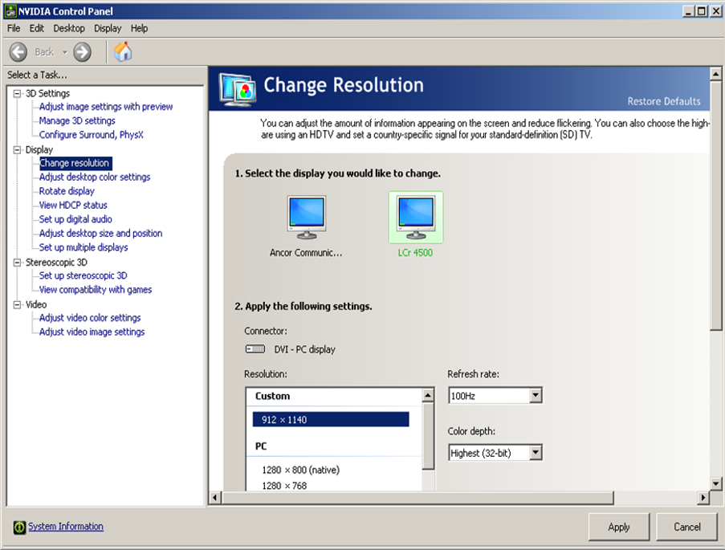

# Protocol to Set Up the LightCrafter

## GUI for the LightCrafter on Your PC

1. Ensure that the GUI for controlling the LightCrafter is installed on your PC.  
   Follow the instructions: [LightCrafter GUI Setup](https://www.youtube.com/watch?v=a0PYaWOm0t8)

2. To recognize the LightCrafter as a “screen” device named **“Lcr 4500”**, connect the HDMI cable to either:
   - An HDMI port, or
   - A DisplayPort with an adapter.

3. To operate the LightCrafter using its GUI, connect the USB cable.

---

## Adjusting Settings on Your PC

1. Right-click on the desktop and select **NVIDIA Control Panel**.

2. Select the display **LCr 4500**, and under **Resolution**, choose **Custom 912 x 1140**.  
   Click **Apply**, and confirm by clicking **Yes**.

3. Navigate to **Rotate Display**, and set the rotation according to the projector's physical tilt (it is typically tilted to one side).

---

## Adjusting Settings in the LightCrafter Software

1. Open the **DLP LightCrafter 4500 Control Software**:  
   `C:\Texas Instruments-DLP\DLPLCR4500GUI-2.0.0.\LightCrafter4500.exe`

2. Click on **System Reset** and wait for a second.

3. Under **Operating Mode**, select **Pattern Sequence** and press **Set**.

4. Under **LED Driver Control**:
   - In **LED Current**, set the **Blue** current to a chosen value*.  
   - In **LED Selection**, click on **Manual** and select **Blue**. Press **Set**.

   *Choose a value balancing sufficient stimulation intensity and minimal bleedthrough in microscope PMTs during scanning.

5. Under **Sequence Settings**:
   - In **Pattern Source**, select **Video port**.  
   - In **Timing**, set **Internal Trigger** and **Pattern Exposure** to **3000**.

6. Under **Sequence Settings → Individual Pattern Settings**:
   - Select **Blue**.  
   - Set **Bit Depth** to **6**.  
   - Tick the box for **Clear DMD after exposure**.  
   - Choose patterns from **G0 to G6** (total 6 bits to match the bit depth).  
   - Press the button **Add Pattern to Sequence** three times and click **Send**.

7. Under **Sequence Validation and Control**, click **Validate Sequence** and then **Play**.

---

## Final Check

- Verify the setup by running a search stimulus, e.g., `search_localCircle`.

---

_Last updated by Sebastian on November 15th, 2024._
