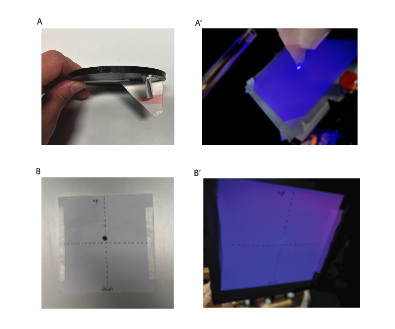
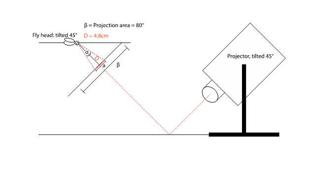
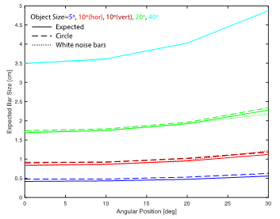

# How to verify the set up and perspective correction: 

## I. Verify the set up:  
 

1. Measure the real distance of the fly eye to the screen, given a 45° angle of the head. 
- a direct measure using the artificial fly holder equipped with a piece of paper that has a 45° angle resulted in 5cm (Figure [1A](#L17)).
- an indirect measurement measuring the straight distance of the fly to the point where the screen touches the holder results in 4.6cm distance
- we decided to assume the distance (D) to be 4.8cm

<!--   -->
 
*Figure 1: Pictures of equipment that can be used to validate the projection parameters.*

## II.	Verify perspective correction:
 

1. Calculate the size a given angle (α) would correspond to on the screen in cm at the center position (angular position=0°) (Figure [2](#L34)): 

   $$a = (\tan(\frac{\alpha}{2}) \times D) \times 2 $$
   
2. For calculating the object size at different angular positions we calculated the delta of two object sizes:  E.g.: 10° size at position 30°: Calculate a (35°) – a (25°).
 
<!--   -->

 
*Figure 2: Illustration of the current set-up showing the different parameters.*
 
### Angular postions

| Angular size  | 0°     |10°    |20°    |30°   |
|:------------  |:-------|:------|:------|:-----|
| 5°            | 0.4191 |0.4322 | 0.4748|0.5592|
| 10°           | 0.8399 |0.8662 | 0.9521|1.1227|
| 20°           | 1.6927 |1.7471 | 1.9249|2.2806|
| 40°           | 3.4941 |3.6177 | 4.0277|4.8740|

  *Table 1: Predicted size in cm of objects with different angular sizes at different angular positions projected to the screen*

 

<!--   -->
 
*Figure 3: Plot depicting the relationship between the observed bar size and the angual postion. The solid line is the expected relationship. The bars and circle coincide well with the expected relationship.*

